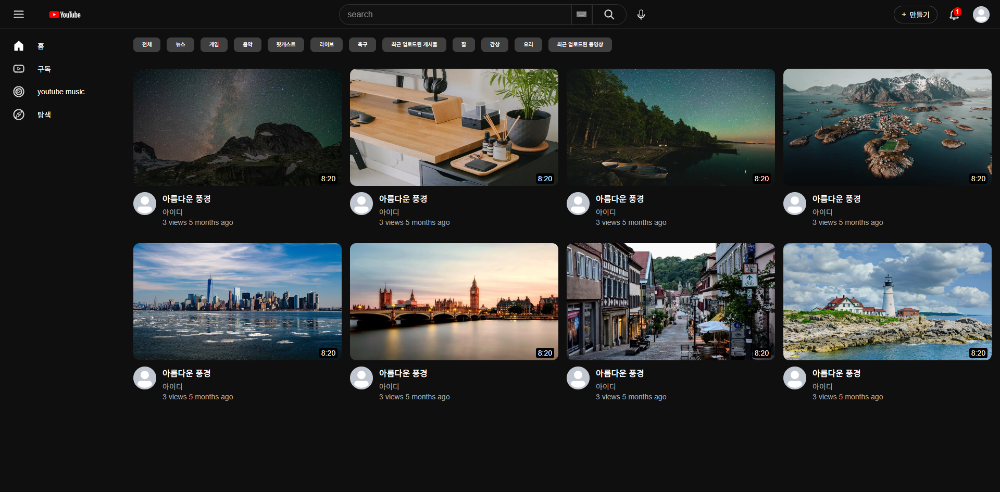
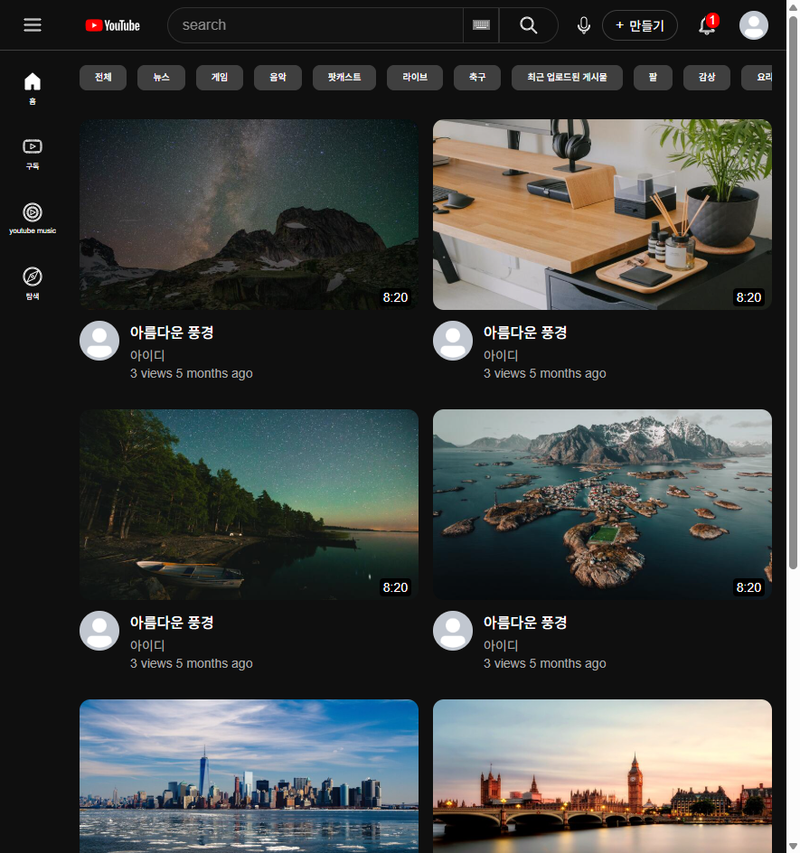

# 📄 YouTube Mock-up

유튜브 홈 화면을 클론한 프로젝트로, HTML5와 CSS3를 활용하여 **PC 우선(Desktop First) 반응형 레이아웃** 기능을 구현하는 데 초점을 맞췄습니다.
추가로 **테마 전환(Dark/Light Mode)** 을 위해 CSS 변수를 활용하여 구현하였습니다.

### 주요 기술 스택
* **HTML5 & CSS3:** 시맨틱 마크업 및 최신 CSS 기술 활용
* **CSS Grid Layout:** 전체 페이지 레이아웃 및 비디오 목록 배치
* **Flexbox:** 헤더 내부 요소 정렬 및 칩 섹션 가로 스크롤 구현
* **CSS Custom Properties (`var()`):** 테마 전환 기반 마련

### 핵심 구현 목표 및 특징

#### 1.페이지 구성 및 레이아웃 구조

| 구성 요소 | 설명 |
| :--- | :--- |
| 페이지 구성 | 유뷰트 홈 화면을 기본으로 하며, 와이어프레임이나 상세 기획서 없이 클론 코딩 형태로 구현. |
| 레이아웃 구조 | Grid Layout을 최상위(`<body>`)에 적용하여 1행에 header, 2행에 sidebar과 main-container로 구성. Header 컴포넌트는 left-section, main-section, right-section으로 구성. main-container는 chips-section과 video-section으로 구성. |
| 반응형 | PC 우선(`max-width`) 전략 사용. sidebar에서는 3단계, video-section에서는 4단계로 제어. |

#### 2. 폴더 구조

```
youtube-mock-up/
├── index.html
├── styles/          
│   ├── 01-general.css
│   ├── 02-header.css
│   ├── 03-sidebar.css
│   ├── 04-chips.css
│   └── 05-video.css
├── assets/
│   ├── icons  
│   ├── images/         
│   └── screenshots/
└── README.md
```


#### 3. CSS 파일별 역할 및 기술 

| 파일 | 핵심 기술 및 특징 |
| :--- | :--- |
| 01-general.css | **CSS Grid**를 활용한 3분할 레이아웃. **PC 우선** 반응형 전략. **CSS 변수** 정의. |
| 02-header.css | **Flexbox**를 활용한 좌/중/우 섹션 정렬. 검색창 테두리 조작 (`border-left: none;`)을 통한 시각적 연결 및 **툴팁** 구현. `position: fixed`와 `z-index`를 사용한 헤더 고정. |
| 03-sidebar.css | 3단계(`240px` → `72px` → `0px`) **반응형 축소** 구현. |
| 04-chips.css | **`overflow-x: auto`** 를 사용한 **지역적 가로 스크롤** 제어. |
| 05-video.css | **반응형 Grid**를 사용한 **4열 → 1열 자동 전환** 비디오 목록 배치. |

#### 4. 레이아웃 구조

| **레이아웃 구조** | **클래스 이름 예시** | **CSS 역할** |
| --- | --- | --- |
| **Header** | `.header`, `.left-section`, `.search-bar`, `.voice-search-button` | Flexbox 정렬, 검색창 테두리 공유, `position: fixed` |
| **Sidebar** | `.sidebar`, `.sidebar-link`, `.sidebar-link.active` | Grid 영역 지정, 3단계 반응형 너비 제어, `:hover` 및 `.active` 상태 |
| **Video** | `.video-section`, `.video-info-grid`, `.thumbnail` | CSS Grid를 사용한 반응형 열(`4열` → `1열`) 전환, `aspect-ratio` 비율 유지 |
| **Rules** | `--bg-primary`, `--text-primary`, `--chip-bg` | **CSS Variables**를 활용하여 테마 전환 대비 (Dark Mode Default) |

#### 5. 레이아웃 및 디자인 디테일

* **반응형 전략:** 반응형 전략: PC 우선(Desktop First) 전략을 채택하여 `max-width` 미디어 쿼리를 사용하여 스타일을 점진적으로 덮어쓰도록 구성.
* **테마 전환:** 모든 색상을 **CSS Variables**로 정의하여 테마 전환 대비.
* **버그 해결:** Grid 영역 충돌과 `overflow` 속성의 전역/지역 충돌 문제를 성공적으로 해결.
* **접근성 (A11y)**: 모든 아이콘 버튼과 링크에 aria-label 속성을 추가하여 스크린 리더 사용자를 고려.

### 결과 화면 (Screenshots)


